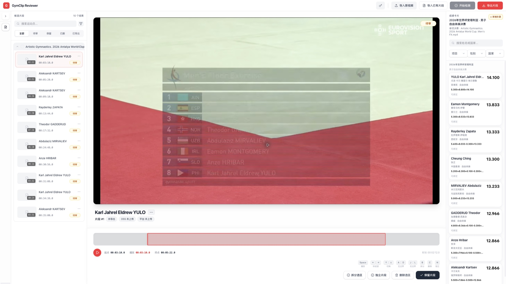
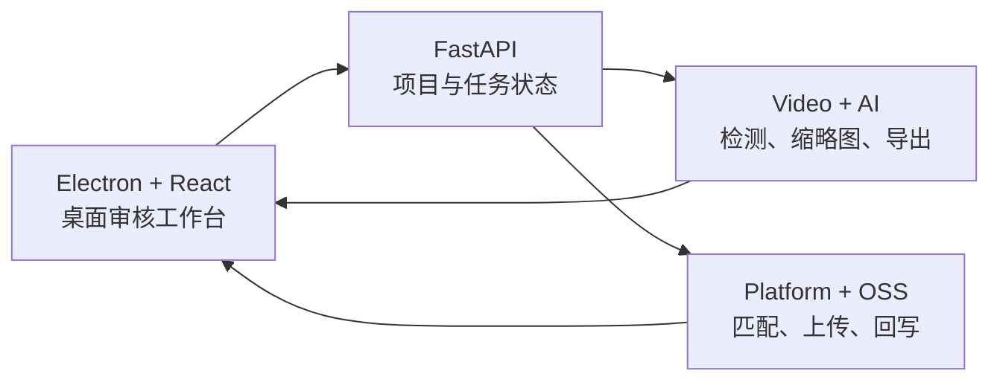

<div align="center">
  
  <h1>GymClip Reviewer</h1>
  <p><strong>体操比赛视频的 AI 候选生成、人机复核与交付工作台</strong></p>
  <p>
    <a href="https://github.com/cris-hu01/gymnastics-video-reviewer/actions/workflows/ci.yml"></a>
    <a href="https://github.com/cris-hu01/gymnastics-video-reviewer/releases"></a>
    <a href="LICENSE"></a>
  </p>
</div>



GymClip Reviewer 不是通用剪辑器。它面向赛事视频运营与审核人员，把分散在播放器、剪辑软件、成绩表和上传页面之间的工作，收敛为一条可复核、可恢复、可批量交付的桌面流程：

> 导入长视频 -> AI 生成候选片段 -> 人工审核与微调 -> 成绩卡片绑定 -> 批量导出与平台回写

## Why / 为什么做

传统赛事视频处理需要逐条定位运动员、剪辑、命名、核对成绩并上传。真正的难点不是“剪一段视频”，而是在长视频、多人、多轮审核和平台数据之间维持一致性。

在一段 **38:31** 的真实比赛样本中，系统从 **58 个原始识别片段** 合并出 **10 个候选**，经人工复核保留 **8 个片段**，并完成 **8 条成绩绑定**。产品目标不是替代判断，而是把机器擅长的“找候选”和人擅长的“做决定”接成一个闭环。

## Product principles / 产品原则

- **Human-in-the-loop**：AI 只生成候选，不把概率结果伪装成最终事实。
- **Single review surface**：播放器、候选列表、时间线与成绩卡片同屏，审片过程中不遮挡视频。
- **Reviewable state**：保留、删除、裁剪、绑定与导出状态可追溯，异常退出后可以恢复。
- **Real workflow first**：围绕赛事运营的命名、批处理、OSS 与平台回写设计，而不是堆叠通用剪辑功能。
- **Safe automation**：API Key 使用系统安全存储；上传与外部写入保留明确的人为确认边界。

## Core workflow / 核心流程

1. **Import**：导入一个或多个比赛视频，并从平台获取可匹配的成绩数据。
2. **Detect**：结合字幕区域、采样策略与视频信号生成候选片段。
3. **Review**：在同一工作台播放、微调起止点、拆分、删除或保留候选。
4. **Bind**：将保留片段与运动员成绩卡片一一绑定。
5. **Deliver**：批量导出、规范命名，并按配置执行 OSS 上传与平台回写。

## Architecture / 技术实现



- **Desktop**：Electron, React 19, TypeScript, Zustand, Vite
- **Backend**：Python, FastAPI, Pydantic, PyInstaller
- **Media**：OpenCV, ffmpeg / ffprobe
- **Quality**：pytest, Playwright, TypeScript checks, GitHub Actions
- **Delivery**：electron-builder, macOS / Windows release workflow, Sentry

## Engineering quality / 工程管理

这个仓库使用轻量但完整的公开协作流程：

- `main` 保持稳定，功能与修复通过短分支和 Pull Request 合并。
- CI 检查前端类型与生产构建，并运行后端测试；当前基线为 **257 tests passed / 59% coverage**。
- Issue Forms 分离 bug 与 feature request，并要求复现步骤、范围和验收标准。
- PR 模板要求说明 Why、Scope、Validation、风险与后续项。
- Release 使用语义化版本与预发布标签，自动构建 macOS / Windows 产物。

最近的 CI、PR 和版本记录可以直接查看：

- [GitHub Actions](https://github.com/cris-hu01/gymnastics-video-reviewer/actions)
- [Pull Requests](https://github.com/cris-hu01/gymnastics-video-reviewer/pulls?q=is%3Apr+is%3Aclosed)
- [Releases](https://github.com/cris-hu01/gymnastics-video-reviewer/releases)

## Repository map / 仓库结构

| Path | Responsibility |
| --- | --- |
| `desktop-app/gymclip-reviewer/` | React 前端、Electron 主进程、打包与自动更新 |
| `desktop-app/backend/` | FastAPI、检测、审核、导出、平台与 OSS 服务 |
| `desktop-app/docs/` | 产品规格、交互结构、前后端契约与评估报告 |
| `.github/workflows/` | CI 与跨平台 Release 自动化 |
| `.github/ISSUE_TEMPLATE/` | 结构化 bug / feature intake |

## Run locally / 本地运行

前置环境：Node.js 22+、npm 11+、Python 3.10+、ffmpeg。

```bash
git clone https://github.com/cris-hu01/gymnastics-video-reviewer.git
cd gymnastics-video-reviewer/desktop-app

# Terminal 1: backend
cd backend
python3 -m pip install -r requirements.txt
python3 main.py

# Terminal 2: desktop frontend
cd ../gymclip-reviewer
npm ci
npm run electron:dev
```

更完整的构建、打包和平台说明见 [`desktop-app/README.md`](desktop-app/README.md)。

## Project status / 项目状态

- 已完成导入、检测、人工复核、裁剪、成绩绑定、批量导出与状态恢复主链路。
- macOS / Windows 构建流程已经进入 Release 工作流；不同平台的安装包与签名状态以 [Releases](https://github.com/cris-hu01/gymnastics-video-reviewer/releases) 为准。
- 仓库使用脱敏示例与公开测试数据，不包含真实平台凭据、用户视频或生产配置。

## Contributing

欢迎通过 Issue 描述真实工作流问题。提交代码前请阅读 [`desktop-app/CONTRIBUTING.md`](desktop-app/CONTRIBUTING.md)，并在 PR 中写清楚问题、范围、验证方式和回退边界。

## License

[MIT](LICENSE) © 2026 Hu Weiqiang
